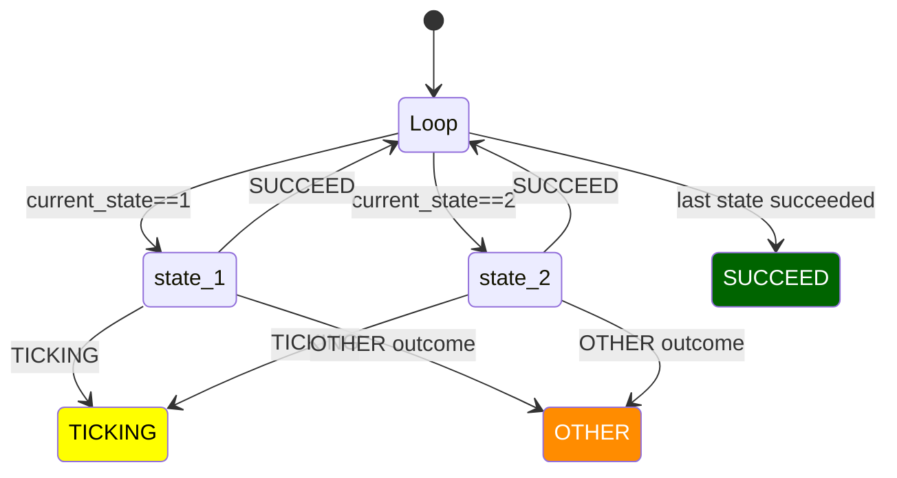
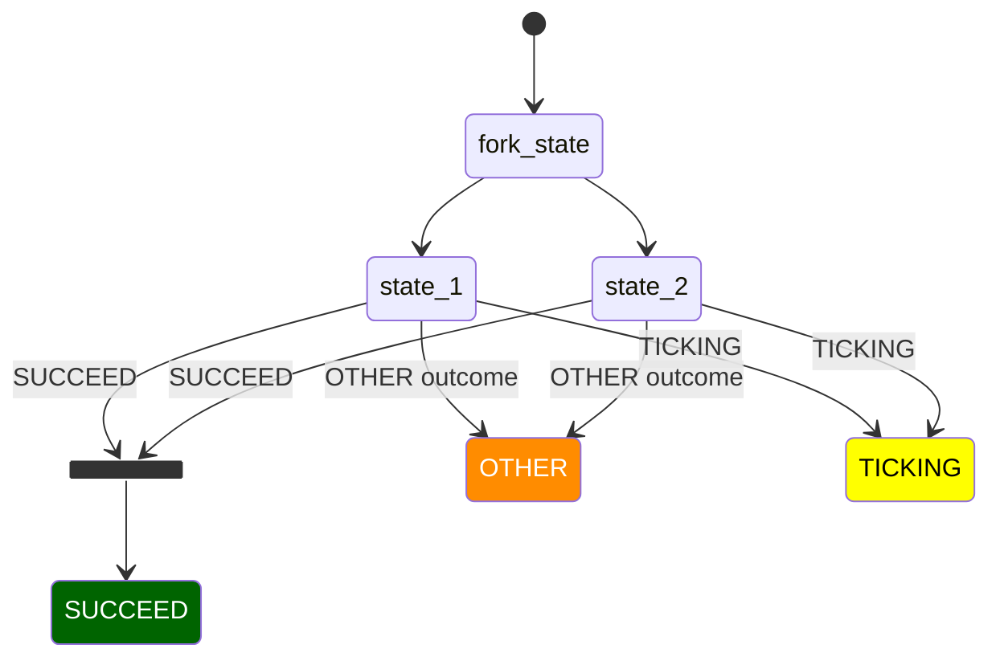

# TODO list


- Investigate the difference between reset() and cancel_state().  How does the original yasmin code handles concurrent access?


### Definition of Sequence, Fallback and concurrent equivalents


### Ordinary sequence


### Concurrent Sequence
The order of the sequence is followed at each tick:




 ```mermaid
    stateDiagram-v2     
        direction TB       
        classDef successClass  fill:darkgreen,color:white
        classDef tickingClass  fill:yellow,color:black
        classDef otherClass  fill:darkorange,color:white
        classDef abortClass  fill:darkred,color:white

        
        state fork_state <<fork>>    
        [*] --> fork_state
        fork_state --> state_1  
        fork_state --> state_2
        state join_state <<join>>
        state_1 --> join_state : SUCCEED    
        state_1 --> OTHER : OTHER outcome    
        state_2 --> join_state : SUCCEED
        state_2 --> OTHER : OTHER outcome
        join_state --> SUCCEED
        state_1 --> TICKING : TICKING
        state_2 --> TICKING : TICKING
        
        class SUCCEED successClass
        class OTHER otherClass
        class TICKING tickingClass
        class TIMEOUT abortClass
```