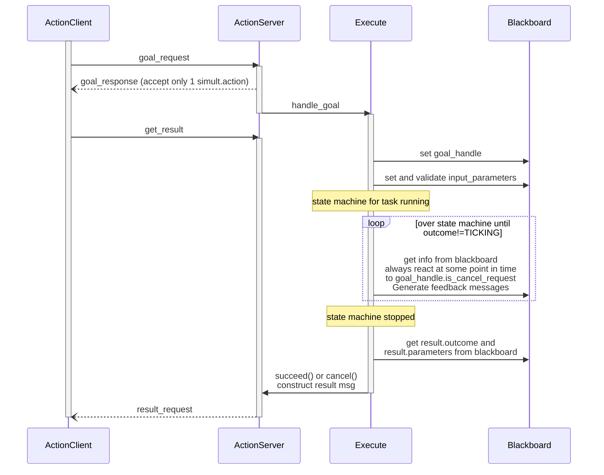

# Action Server

## Interface

The following class implements an action server that respond to actions
with idl:
```
# only from the perspective of the state-machine
# we can have generic handling of the parameters.
# (perhaps needing adaptation of your handling of eTaSL parameters, such that they can also take parameters that are set beforehand
# in the blackboard, i.e. not overwritten by defaults if they exist)
#
# goal
string task
string parameters
---
# result
string outcome
string parameters
---
# feedback
string state
string parameters
```

This interface is generic and applies to all state machines that are controlled:

- **goal**
  `task` is a label that indicates which state-machine needs to be executed
  `parameters` is a string with JSON describing the parameters of the task.  These parameters will be put in BeTFSM's blackboard for use within the statemachine.
  Optionally these parameters can be validated using a JSON-Schema 

- **result**
`outcome` is `cancel` or `success`
`parameters` is everything what is in `blackboard["result"]` encoded into a JSON string.

- **feedback**
`state` is the label of the currently active state of state-machine.
`parameters` is everything what is in `blackboard["feedback"]` encoded into a JSON string


## Server


The state machine is run in the EXECUTING state of the above figure from the ROS2 documentation.  The [goal_callback][betfsm.betfsm_action_server.BeTFSMActionServer.goal_callback] checks whether the task exists in the dictionary of state machines and optionally validates the input parameters of the task using a schema.  
The action server is implemented in the [BeTFSMActionServer][betfsm.betfsm_action_server.BeTFSMActionServer] described below.

The tasks that the action server can react to are described by a Dictionary that maps the name of the task to an instance of TickingState (a state machine)..


- Sequence diagram of interactions:



To specify a schema to validate the parameters, add `input_parameters_schema` member to the TickingState with the schena in python format (i.e. using json.loads("..." )

::: betfsm.betfsm_action_server.BeTFSMActionServer
    options:
      heading_level: 3
      show_source: false
      show_root_heading: true 

## Giving intermediate feedback

::: betfsm.betfsm_action_server.FeedbackState
    options:
      heading_level: 3
      show_source: false
      show_root_heading: true 


## Checking for cancelation

Actions can be canceled and our action server and state machines need to react appropriately.

## Interaction diagram


### example_action_server

The `example_action_server` example shows a case where we continuously check for an action and when an
cancelation is detected go out of the state machines and perform a shutdown procedure.  The following class is
used for this purpose:

::: betfsm.betfsm_action_server.WhileNotCanceled
    options:
      heading_level: 4
      show_source: false
      show_root_heading: true 


This class runs its underlying state and has transitions that depend on the outcome of the underlying state or on cancelation requests.  With this we can build a simple statemachine to implement what should happen when cancel is requested:

```
class CheckingCancelAndShutdown(TickingStateMachine):
    def __init__(self,name:str,state:TickingState,srv_name:str="/etasl_node",timeout:Duration = Duration(seconds=1.0), node : Node = None):
        # execute in sequence but don't care about ABORT, only way to fail is TIMEOUT
        super().__init__(name,[CANCEL,SUCCEED])

        self.add_state(state=WhileNotCanceled("while_not_canceled",state), transitions={CANCEL:"DEACTIVATE_ETASL",SUCCEED:SUCCEED, TIMEOUT:"DEACTIVATE_ETASL"})

        self.add_state(state=LifeCycle("DEACTIVATE_ETASL",srv_name,Transition.DEACTIVATE,timeout,node),
                       transitions={SUCCEED: "CLEANUP_ETASL",  ABORT: "CLEANUP_ETASL", TIMEOUT:"CLEANUP_ETASL"} )
        self.add_state( state=LifeCycle("CLEANUP_ETASL",srv_name,Transition.CLEANUP,timeout,node),
                       transitions={SUCCEED: CANCEL, ABORT: CANCEL,TIMEOUT: CANCEL} )
```


### example_action_server2


The `example_action_server2` describes another approach where there is only a check for cancelation
at specific locations of the state machine(s).  The following TickingState is used for this purpose:


::: betfsm.betfsm_action_server.CheckForCanceledAction
    options:
      heading_level: 4
      show_source: false
      show_root_heading: true 


