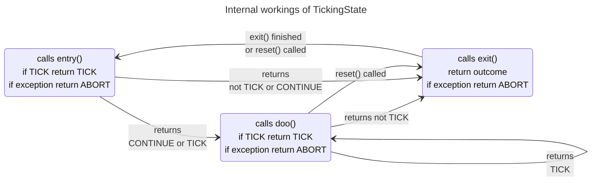
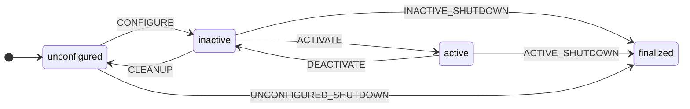

<!-- Optional: full-bleed banner image with overlay text (use if your logo should sit on the left) -->
<div style="position:relative; width:100%; background:#004070;">
  <div style="max-width:1200px; margin:0 auto; padding:16px; display:flex; align-items:center; gap:24px;">
    
    <div style="color:#ffffff;">
      <div style="font-size:50px; font-weight:700; line-height:1.2;"> &nbsp; </div>
      <div style="font-size:16px; font-weight:500; opacity:0.9;">Behavior Trees &amp; Finite State Machines for Robotics</div>
    </div>
  </div>
</div>

<p/>

BeTFSM is a library for "ticking" statemachines and behavior trees. In this
unified framework, discrete tasks can be specified with the modularity of
behavior trees and at the lower-level precise interaction can be specified
using state machines. It targets discrete coordination of robotic systems at
both high- and low level.

<p/>

Published under the GNU LESSER GENERAL PUBLIC LICENSE Version 3, 29 June 2007.

(c) 2024, KU Leuven, Department of Mechanical Engineering, ROB-Group: Erwin Aertbeliën, 
contributions of Federico Ulloa Rios and Santiago Iregui Rincon

<p>
  <a href="https://aiprism.eu/"></a>
  This work was funded by the European Union’s Horizon 2020 research and innovation program 
  under <a href="https://aiprism.eu/">grant agreement No. 101058589 AI-Prism</a>
</p>


## Introduction

The basic class from where all behavior tree nodes and state machines are derived is a TickingState.
Each [TickingState][betfsm.betfsm.TickingState] (see [API][betfsm.betfsm.TickingState] for detailed definition) is defined by the following methods:

 - **entry(self,blackboard:Blackboard)**:
    executed when the state is entered
    
 - **doo(self,blackboard:Blackboard)**:
    execute while the state is running.  The state can take a longer time
    but should regularly yield by returning TICKING. Is implemented by derived classes.
 - **exit(self)**:
    is execute when the state exits, note that it does not has the blackboard as argument.
    Will even be called when the other methods return an exception. Is implemented by derived classes
 - **reset(self)**:
    Resets the state (i.e. calls exit() when appropriate and ensures that the next time, entry() will be called)
 - **accept(self, visitor:Visitor)**: calls the visitor that you pass as an argument and possibly iterates over
    its children, e.g. to generate a visual representation of the behavior tree.


There is an additional **execute** member function that typically should not be touched.

!!! error "WARNING"
    A TickingState is low-overhead and synchronous. It is expected to return quickly, and 
    if further processing is needed to return TICK. If there is code in **doo** and **entry** that blocks,
    the execution of the whole BeTFSM tree blocks, including concurrent TickingStates.  For blocking code,
    the TickingState should create its own thread. 





When using the state one calls it with the () operator. This calls then the execute() method that calls the entry,doo,exit methods
appropriately, according to the figure above.


The [visitor pattern](https://en.wikipedia.org/wiki/Visitor_pattern) is used to be able to generically travers the hierarchy of states.
the **accept** method of a TickingState calls the visitor appropriately.  Visitor is defined  [here][betfsm.betfsm.Visitor]

!!! Blackboard
    All TickingStates can read and write from a common **blackboard** of type
    **Blackboard: TypeAlias = Dict[str, Dict|any]**, i.e. a hierarchically
    organized common storage where all TickingStates can update information or get
    information from.

!!! Parameters
    When defining new TickingStates, remember to distinguish between
    construction-time (arguments given to constructor) and run-time (passed using a
    certain location in the blackboard) parameters.  Typically the **location**
    (not the value!) of the run-time parameters is passed as parameters to the
    constructor, such that the TickingState is easily reusable in different applications.

!!! Predefined outcomes
    There are a series of predefined outcome strings.  Other outcome strings can be defined,
    but it is recommended to use the predefined outcomes, as long as it fits your semantics.
    This helps interoperability of different nodes in the behavior tree.

    - SUCCEED  = "succeeded"    # everything is fine, continue as normal
    - CANCEL   = "canceled"     # voluntary stop, deliberatly provoked, e.g. reacting to cancel request of an action
    - TIMEOUT  = "timeout"      # some operation times out.

!!! Reserved outcomes
    These outcome names are reserved and have a specific meaning enforced by the framework.

    - ABORT    = "aborted"      # involuntary stop, e.g. due to exception raised, communication failure,... Allows the state machine to deal with exceptions.
    - TICKING  = "ticking"      # only use this to yield and expecting to be called back the next tick
    - CONTINUE = "continue"     # only used in the entry() method of TickingState, to signal tht you want to directly continue with Doo().  Don't use it anywhere else


## Summary of states and state-machines

This section explains the basics of BeTFSM.  You find more detailed information in the sections BeTFSM, BeTFSM ROS2, BeTFSM eTaSL which contain a full API-documentation.

Sometimes states have underlying states, e.g. a state-machine or a sequence.  Typically they can be specfied in two ways:

  - a list of children in the constructor. This is handy when the substates are also simple to construct.  If there is only one underlying state, the constructor argument is typically called `state`, if there are multiple underlying states, the constructor argument is typically called `children`.
  - by subclassing the state (e.g. Sequence), and calling `add_state()` in the constructor of this subclass.  This is handy when the definition of the substates is a bit more complex.

In some cases, more information needs to be given and only the `add_state` approach is applicable (e.g. TickingStateMachine).


### The state-machine state


[TickingStateMachine][betfsm.betfsm.TickingStateMachine] implements a basic state machine. You
can add nodes using [add_state][betfsm.betfsm.TickingStateMachine.add_state].  In this call
you also specify the transitions between states.  These transitions are specified by mapping an outcome of the state to the name of one of the states in the state machine.  

The [constructor][betfsm.betfsm.TickingStateMachine.__init__] takes a (**instance**) name of the state machine, its allowable outcomes and two optional callback functions `transitioncb` and `statecb`.
Default implementations of the callbacks are described in [default|_transition_cb][betfsm.betfsm.default_transitioncb] and [default_statecb][betfsm.betfsm.default_statecb].

### Behavior-tree like states

The most important behavior-tree like states are [Sequence][betfsm.betfsm.Sequence],[Fallback][betfsm.betfsm.Fallback],
[ConcurrentSequence][betfsm.betfsm.ConcurrentSequence],[ConcurrentFallback][betfsm.betfsm.ConcurrentFallback], and [Repeat][betfsm.betfsm.Repeat]

The main difference is that for a typical behavior-tree implementation the outcomes can only be RUNNING, SUCCESS or FAILURE. Here, there can be more types of outcome.   The mapping to traditional behavior trees is explained below, detailed behavior is documented in the diagrams in the API-documentation.

- **Fallback** (or *Any(success)*):   Implements a behaviortree-like Fallback node (concurrently executed):

    - other outcome is success
    - CANCEL outcome is failure
    - TICKING outcome is running

    Finishes if **any** has success.  Success is defined by an outcome different from CANCEL.
    In other words, success can be differentiated by different outcomes.

- **Sequence** (or *All(success)*). Implements a behaviortree-like Sequence node (concurrently executed):
    - SUCCEED outcome is success,
    - any other outcome is failure
    - TICKING outcome is running

    Finishes if **all** have success. Success is defined by an outcome SUCCEED.
    In other words, failure can be differentiated by different outcomes.

[ConcurrentSequence][betfsm.betfsm.ConcurrentSequence] and [ConcurrentFallback][betfsm.betfsm.ConcurrentFallback] are basically the same as [Sequence][betfsm.betfsm.Sequence] and [Fallback][betfsm.betfsm.Fallback] but execute concurrently: at each tick they go to their complete list of states and follow the logic of sequence or fallback. e.g. in a ConcurrentSequence the states are executed concurrently, but within one tick, they are executed in the order specified.

[Concurrent][betfsm.betfsm.Concurrent] executes also its children concurrently (calling them in sequence for each tick). Concurrent stops executing when any child returns any outcome different from TICKING. See [API][betfsm.betfsm.Concurrent] for description fo detailed behavior.

The **Repeat** state has one underlying state and repeats this state for a given number of times.


### Related to conditions

- [waitFor][betfsm.betfsm.WaitFor] waits until a condition is satisfied.  This condition is given by a callback.
   Note that this callback can be defined using Python's [lambda](https://python-reference.readthedocs.io/en/latest/docs/operators/lambda.html)
- [WaitForever][betfsm.betfsm.WaitForever] waits forever, you probably want something to be running in parallel with this.
- [While][betfsm.betfsm.While] continues to execute the underlying state while checking the given condition. It finishes with CANCEL when the condition returns false, it finishes also when the underlying state finishes and returns the outcome of the underlying state.

### Related to output

- [Message][betfsm.betfsm.Message] is a state to quickly return send message to the log.
Its arguments are either a string or either a callback function.  Since the string is specified at
construction time, the callback function is handy when you want to return something depending on the actual state while running.  Python's [lambda](https://python-reference.readthedocs.io/en/latest/docs/operators/lambda.html) could be useful to specify the callback.

- [LogBlackboard][betfsm.betfsm.LogBlackboard] logs the blackboard or a part of the blackboard.
The location to log is given by a list of strings.  

Example:
   ```
   LogBlackboard|(["output","move_home"])
   ```
   Logs the content of the blackboard under `blackboard["output]["move_home"]`

### Related to timing

- [TimedWait][betfsm.betfsm_ros.TimedWait] waits for the given duration and returns SUCCEED.
- [TimedRepeat][betfsm.betfsm_ros.TimedWait] repeats the underlying state for a given number of time.  The time between two repetitions is specified.
- [Timeout][betfsm.betfsm_ros.Timeout] executes the underlying state at long as its outcome is TICKING. It finishes when the outcome is not ticking and returns this outcome.  It also finishes when the given duration is exceeded and returns TIMEOUT.

### Related to ROS 2 services, life cycle and topics

To manage file locations in a ROS2 environment a function [expand_ref][betfsm.betfsm_ros.expand_ref] is provided that expands references to ROS2 packages (or more preciselly ament packages) (using `$[packagename]`) or environmental variables (using `${environmental_variable}`)


- [ServiceClient][betfsm.betfsm_ros.ServiceClient] creates a TickingState that calls a ROS2 service and generates an outcome when the service returns back. While waiting, it continues to tick. Subclasses need to implement two methods `fill_in_request` to fill in the service request, most probably using information from the blackboard, and `process_result` to process the result from the service request, most probably putting some information in the blackboard.

- [LifeCycle][betfsm.betfsm_ros.LifeCycle] manages the lifecycle of some other ROS2 node.
  The node is constructed with service_name, transition (see below), timeout and the transition is requested during execution of the state.
  See below for a simplified view of this lifecycle (transition states not included):


   These are the transtions that can be passed to a LifeCycle state:
    ```python
        class Transition(Enum):
            CONFIGURE              = 1
            CLEANUP                = 2
            ACTIVATE               = 3
            DEACTIVATE             = 4
            UNCONFIGURED_SHUTDOWN  = 5
            INACTIVE_SHUTDOWN      = 6
            ACTIVE_SHUTDOWN        = 7    
    ```

### Related to eTaSL

### Defining your own states

To implement a TickingState, you have to implement:

- `def entry(self, blackboard: Blackboard) -> str`  called when execute() is called for the first time. returns an outcome but has one additional outcome CONTINUE that indicates its preference to directly call `doo()` after its return, without a tick.
- `def doo(self, blackboard: Blackboard) -> str` called for the duration of the task, as long as you return TICKING
- `def exit(self) -> str`: should call `return super().exit()` at the end, is guaranteed to be called after the last time that execute() was called.
- `def reset(self)->None:`  should call `super().exit()` at the end: to reset the state *and its children*.
- `def accept(self, visitor:Visitor)` calls `pre` on the visitor, calls accept(visitor) on all its children, and then calls `post` on the visitor.  


Keep in mind that the `reset` and `accept` methods still need to be defined when the state has children (otherwise 
the default implementations are sufficient)

!!! Warning
    Forgetting to implement these methods can lead to silent failures.  Even worse, the state will 
    work the first time, but not the second time.

!!! Warning
    Outside code that repeately calls a state-machine has to call `reset` itself before calling the state-machine. This method
    calls the reset method of all its children and calls the reset method of its superclass `TickingState`
  
### Facilitating implementation of a TickingState

To facilitate the definition of tickingStates, you can use [Python generators](https://www.geeksforgeeks.org/generators-in-python/), for this 
the [Generator][betfsm.betfsm.Generator] class is defined.  Generator is a generic TickingState that implements methods **entry**, **doo** and **exit**.  
Users can define new TickingStates by defining the method `co_execute(self, blackboard:Blackboard)`.  This method is a co-routine and can regularly 
yield control using a `yield <outcom>` statement. This makes it easy to specify a TickingState.

For common usecases, further (generic) specializations are provided by:

- [GeneratorWithState][betfsm.betfsm.GeneratorWithState] for a Generator with **one** child state 
- [GeneratorWithList][betfsm.betfsm.GeneratorWithLists]  for a Generator with **a (ordered) list of** childs. 

These implementations implement correctly `reset` and `accept` for you and manage the child nodes (TickingStates) of
your TickingState.  Most of the other nodes are implemented using these auxiliary classes.

!!! Recommendation
    Look at a few implementations such as `WaitFor`,`Repeat`, `Concurrent`.  This will help making your own nodes.
    Often it is sufficient to implement the constructor and the co_execute(self,blackboard) method and yield when
    you want to yield control to BeTFSM, and come back at the same location the next tick of BeTFSM.

### Action server

There is also a ROS2 Action server provided that allows us to respond to ROS2 Actions.  This contains
also a generic parameter-passing mechanism with a JSON message string that in the black-board of BeTFSM.

### Action client

**ActionClientBTFSM** contains a Tickingstate that calls and action and generates an outcome when the action 
returns back.   While waiting it gets the response of the action.

