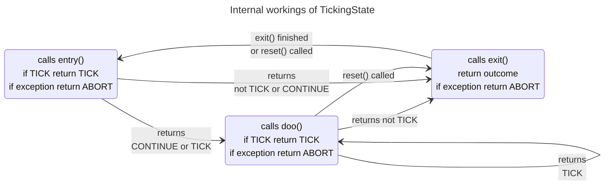
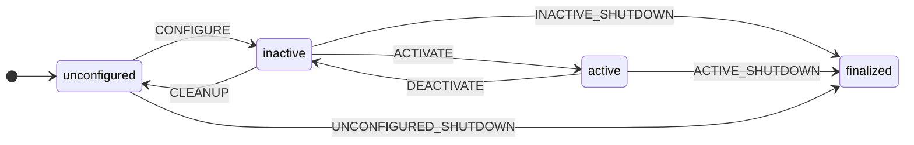

# Home

## Introduction
This is a library for "ticking" statemachines, it is originally based upon the [Yasmin](https://github.com/uleroboticsgroup/yasmin) library, but is substantially changed

!!! error "TODO"
    Completely decouple from yasmin?  nothing substantial is left and would be easy to completely decouple from Yasmin.   Certainly in practice, it is used completely differently.  

Each [TickingState][yasmin_etasl.yasmin_ticking.TickingState] (see [API][yasmin_etasl.yasmin_ticking.TickingState] for detailed definition) is defined by the following methods:

 - **entry(self,blackboard)**:
    executed when the state is entered
    
 - **doo(self,blackboard)**:
    execute while the state is running.  The state can take a longer time
    but should regularly yield by returning TICKING.
 - **exit(self)**:
    is execute when the state exits, note that it does not has the blackboard as argument.
    Will even be called when the other methods return an exception.
 - **reset(self)**:
    Resets the state (i.e. calls exit() when appropriate and ensures that the next time, entry() will be called)





When using the state one calls it with the () operator. This calls then the execute() method that calls the entry,doo,exit methods
appropriately, according to the figure above.


The [visitor pattern](https://en.wikipedia.org/wiki/Visitor_pattern) is used to be able to generically travers the hierarchy of states.
the **accept** method of a TickingState calls the visitor appropriately.  Visitor is defined  [here][yasmin_etasl.yasmin_ticking.Visitor]


## Summary of states and state-machines

For full specification, see the API-documentation.

Sometimes states have underlying states, e.g. a state-machine or a sequence.  Typically they can be specfied in two ways:

  - a list of children in the constructor. This is handy when the substates are also simple to construct.  If there is only one underlying state, the constructor argument is typically called `state`, if there are multiple underlying states, the constructor argument is typically called `children`.
  - by subclassing the state (e.g. Sequence), and calling `add_state()` in the constructor of this subclass.  This is handy when the definition of the substates is a bit more complex.

In some cases, more information needs to be given and only the `add_state` approach is applicable (e.g. TickingStateMachine).


### The state-machine state

[TickingStateMachine][yasmin_etasl.yasmin_ticking.TickingStateMachine] implements a basic state machine. You
can add nodes using [add_state][yasmin_etasl.yasmin_ticking.TickingStateMachine.add_state].  In this call
you also specify the transitions between states.  These transitions are specified by mapping an outcome of the state to the name of one of the states in the state machine.  

The [constructor][yasmin_etasl.yasmin_ticking.TickingStateMachine.__init__] takes a (**instance**) name of the state machine, its allowable outcomes and two optional callback functions `transitioncb` and `statecb`.
Default implementations of the callbacks are described in [default|_transition_cb][yasmin_etasl.yasmin_ticking.default_transitioncb] and [default_statecb][yasmin_etasl.yasmin_ticking.default_statecb].

### Behavior-tree like states

The most important behavior-tree like states are [Sequence][yasmin_etasl.yasmin_ticking.Sequence],[Fallback][yasmin_etasl.yasmin_ticking.Fallback],
[ConcurrentSequence][yasmin_etasl.yasmin_ticking.ConcurrentSequence],[ConcurrentFallback][yasmin_etasl.yasmin_ticking.ConcurrentFallback], and [Repeat][yasmin_etasl.yasmin_ticking.Repeat]

The main difference is that for a typical behavior-tree implementation the outcomes can only be RUNNING, SUCCESS or FAILURE. Here, there can be more types of outcome.   The mapping to traditional behavior trees is explained below, detailed behavior is documented in the diagrams in the API-documentation.

- **Fallback** (or *Any(success)*):   Implements a behaviortree-like Fallback node (concurrently executed):

    - other outcome is success
    - CANCEL outcome is failure
    - TICKING outcome is running

    Finishes if **any** has success.  Success is defined by an outcome different from CANCEL.
    In other words, success can be differentiated by different outcomes.

- **Sequence** (or *All(success)*). Implements a behaviortree-like Sequence node (concurrently executed):
    - SUCCEED outcome is success,
    - any other outcome is failure
    - TICKING outcome is running

    Finishes if **all** have success. Success is defined by an outcome SUCCEED.
    In other words, failure can be differentiated by different outcomes.

[ConcurrentSequence][yasmin_etasl.yasmin_ticking.ConcurrentSequence] and [ConcurrentFallback][yasmin_etasl.yasmin_ticking.ConcurrentFallback] are basically the same as [Sequence][yasmin_etasl.yasmin_ticking.Sequence] and [Fallback][yasmin_etasl.yasmin_ticking.Fallback] but execute concurrently: at each tick they go to their complete list of states and follow the logic of sequence or fallback. e.g. in a ConcurrentSequence the states are executed concurrently, but within one tick, they are executed in the order specified.

[Concurrent][yasmin_etasl.yasmin_ticking.Concurrent] executes also its children concurrently (calling them in sequence for each tick). Concurrent stops executing when any child returns any outcome different from TICKING. See [API][yasmin_etasl.yasmin_ticking.Concurrent] for description fo detailed behavior.

The **Repeat** state has one underlying state and repeats this state for a given number of times.


### Related to conditions

- [waitFor][yasmin_etasl.yasmin_ticking.WaitFor] waits until a condition is satisfied.  This condition is given by a callback.
   Note that this callback can be defined using Python's [lambda](https://python-reference.readthedocs.io/en/latest/docs/operators/lambda.html)
- [WaitForever][yasmin_etasl.yasmin_ticking.WaitForever] waits forever, you probably want something to be running in parallel with this.
- [While][yasmin_etasl.yasmin_ticking.While] continues to execute the underlying state while checking the given condition. It finishes with CANCEL when the condition returns false, it finishes also when the underlying state finishes and returns the outcome of the underlying state.

### Related to output

- [Message][yasmin_etasl.yasmin_ticking.Message] is a state to quickly return send message to the log.
Its arguments are either a string or either a callback function.  Since the string is specified at
construction time, the callback function is handy when you want to return something depending on the actual state while running.  Python's [lambda](https://python-reference.readthedocs.io/en/latest/docs/operators/lambda.html) could be useful to specify the callback.

- [LogBlackboard][yasmin_etasl.yasmin_ticking.LogBlackboard] logs the blackboard or a part of the blackboard.
The location to log is given by a list of strings.  

Example:
   ```
   LogBlackboard|(["output","move_home"])
   ```
   Logs the content of the blackboard under `blackboard["output]["move_home"]`

### Related to timing

- [TimedWait][yasmin_etasl.yasmin_ticking_ros.TimedWait] waits for the given duration and returns SUCCEED.
- [TimedRepeat][yasmin_etasl.yasmin_ticking_ros.TimedWait] repeats the underlying state for a given number of time.  The time between two repetitions is specified.
- [Timeout][yasmin_etasl.yasmin_ticking_ros.Timeout] executes the underlying state at long as its outcome is TICKING. It finishes when the outcome is not ticking and returns this outcome.  It also finishes when the given duration is exceeded and returns TIMEOUT.

### Related to ROS 2 services, life cycle and topics

To manage file locations in a ROS2 environment a function [expand_ref][yasmin_etasl.yasmin_ticking_ros.expand_ref] is provided that expands references to ROS2 packages (or more preciselly ament packages) (using `$[packagename]`) or environmental variables (using `${environmental_variable}`)


- [ServiceClient][yasmin_etasl.yasmin_ticking_ros.ServiceClient] creates a TickingState that calls a ROS2 service and generates an outcome when the service returns back. While waiting, it continues to tick. Subclasses need to implement two methods `fill_in_request` to fill in the service request, most probably using information from the blackboard, and `process_result` to process the result from the service request, most probably putting some information in the blackboard.

- [LifeCycle][yasmin_etasl.yasmin_ticking_ros.LifeCycle] manages the lifecycle of some other ROS2 node.
  The node is constructed with service_name, transition (see below), timeout and the transition is requested during execution of the state.
  See below for a simplified view of this lifecycle (transition states not included):


   These are the transtions that can be passed to a LifeCycle state:
    ```python
        class Transition(Enum):
            CONFIGURE              = 1
            CLEANUP                = 2
            ACTIVATE               = 3
            DEACTIVATE             = 4
            UNCONFIGURED_SHUTDOWN  = 5
            INACTIVE_SHUTDOWN      = 6
            ACTIVE_SHUTDOWN        = 7    
    ```

### Related to eTaSL

### Defining your own states

To implement a TickingState, you have to implement:

- `def entry(self, blackboard: Blackboard) -> str`  called when execute() is called for the first time. returns an outcome but has one additional outcome CONTINUE that indicates its preference to directly call `doo()` after its return, without a tick.
- `def doo(self, blackboard: Blackboard) -> str` called for the duration of the task, as long as you return TICKING
- `def exit(self) -> str`: should call `return super().exit()` at the end, is guaranteed to be called after the last time that execute() was called.
- `def reset(self)->None:`  should call `super().exit()` at the end: to reset the state *and its children*.
- `def accept(self, visitor:Visitor)` calls `pre` on the visitor, calls accept(visitor) on all its children, and then calls `post` on the visitor.  


To facilitate the definition of tickingStates, you can use [Python generators](https://www.geeksforgeeks.org/generators-in-python/), for this 
the [Generator][yasmin_etasl.yasmin_ticking.Generator] class is defined.
This allows to define TickingStates using a python generator method `co_execute(self, blackboard:Blackboard)`.  This routine has to regularly 
yield control using a `yield <outcom>` statement. This makes it easy to specify a TickingState.


Keep in mind that the `reset` and `accept` methods still need to be defined when the state has children (otherwise 
the default implementations are sufficient)

!!! Warning
    Forgetting to implement these methods can lead to silent failures.  Even worse, the state will 
    work the first time, but not the second time.

!!! Warning
    Outside code that repeately calls a state-machine has to call `reset` itself before calling the state-machine.    
  
For the **common use cases** of a Generator with **one child state** and a Generator 
with a **list of child states** implementations are provided that implement `reset` and `accept` for you:
[GeneratorWithState][yasmin_etasl.yasmin_ticking.GeneratorWithState] and 
[GeneratorWithList][yasmin_etasl.yasmin_ticking.GeneratorWithLists] are generic implementations to
 be uses to subclass from while implementing states with one or multiple underlying states.


!!! Recommendation
    Look a a few implementations such as `WaitFor`,`Repeat`, `Concurrent`
