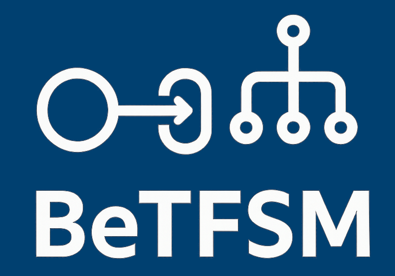

<!-- Optional: full-bleed banner image with overlay text (use if your logo should sit on the left) -->

  

    
    

      
 &nbsp; 

      
Behavior Trees &amp; Finite State Machines for Robotics

    

  

## Introduction

BeTFSM is a library for "ticking" statemachines and behavior trees. In this
unified framework, discrete tasks can be specified with the modularity of
behavior trees and at the lower-level precise interaction can be specified
using state machines. It targets discrete coordination of robotic systems at
both high- and low level.

It consists of multiple packages:

  - **betfsm** contains the core library, only dependent on python packages, e.g. the implementation of a set of state machines and behavior tree nodes, such as [Sequence](sequence.md), [Fallback](fallback.md), [Repeat](repeat.md), [ConcurrentSequence](concurrentsequence.md), ...
  - **betfsm_ros** contains facilities to use BeTFSM on [ROS2](https://github.com/ros2), e.g. managing timing using ROS2, calling services, calling actions, ...
  - **betfsm_crospi** contains facilities to use BeTFSM with [cROSpi](https://github.com/Robotics-Research-Group-KUL/crospi), e.g. communicating with cROSpi over ROS2, managing the lifecycle of a task, sending over parameters to a cROSpi task, ...

In this documentation, you will find the following:

  - Quick [**overview**](overview.md) of behavior trees and state machines
  - [**Installation**](installation.md) instructions using *pip* (python-only) and *ROS2* (with ros and crospi integration)
  - A set of [**tutorials**](tutorials.md) on  using BeTFSM
  - A [**technical introduction**](technical_intro.md) to BeTFSM
  - [**API**](api_overview.md) documentation

## Copyright

Published under the GNU LESSER GENERAL PUBLIC LICENSE Version 3, 29 June 2007.

(c) 2024-2026, KU Leuven, Department of Mechanical Engineering, ROB-Group: Erwin Aertbeliën, 
contributions of Federico Ulloa Rios and Santiago Iregui Rincon

<!--

  
  This work was funded by the European Union’s Horizon 2020 research and innovation program 
  under <a href="https://aiprism.eu/">grant agreement No. 101058589 AI-Prism</a>

 -->

