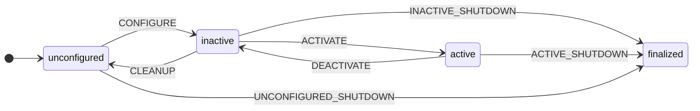

# Managing the LifeCycle of a ROS2 node.

[LifeCycle][betfsm_ros.LifeCycle] manages the lifecycle of some other ROS2 node.
  The node is constructed with service_name, transition (see below), timeout and the transition is requested during execution of the state.
  See below for a simplified view of this lifecycle (transition states not included):


   These are the transtions that can be passed to a LifeCycle state:
    ```python
        class Transition(Enum):
            CONFIGURE              = 1
            CLEANUP                = 2
            ACTIVATE               = 3
            DEACTIVATE             = 4
            UNCONFIGURED_SHUTDOWN  = 5
            INACTIVE_SHUTDOWN      = 6
            ACTIVE_SHUTDOWN        = 7    
    ```
