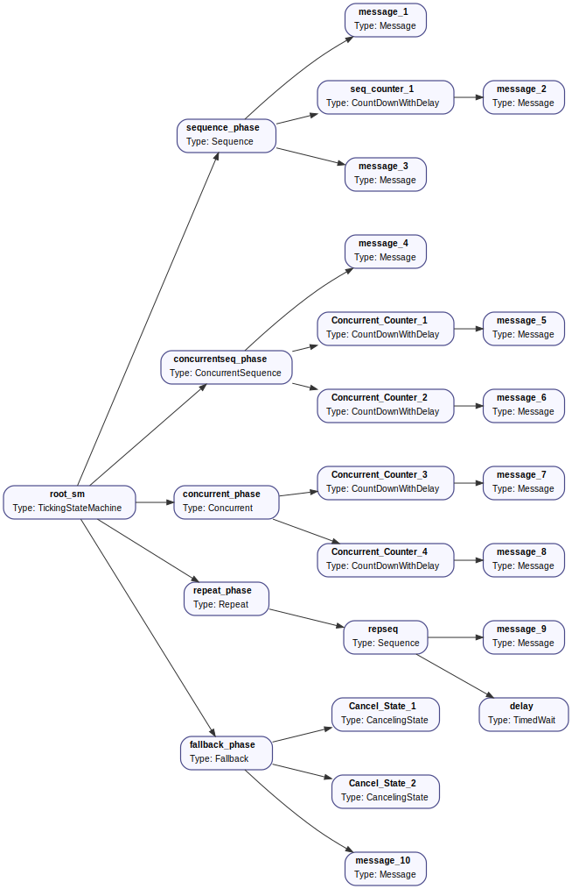
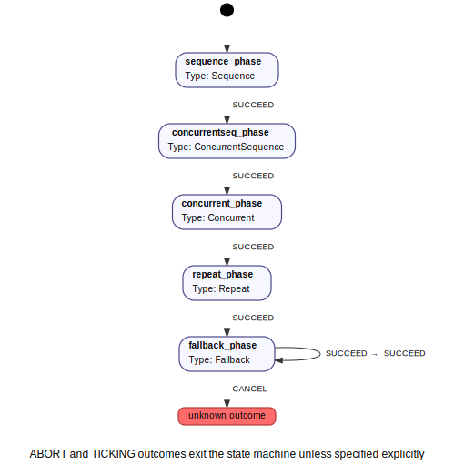

## An example with common BeTFSM nodes

This example is an example of everything together. It contains many of the common
BeTFSM nodes and demonstrates how to use them.  This example is not explained
in detail, but for further information, you can always look up the details in this documentation. 
You can find the code of the example in 
[betfsm_examples](https://github.com/Robotics-Research-Group-KUL/betfsm/blob/main/betfsm/betfsm_examples) in the file
[example_sequence1.py](https://github.com/Robotics-Research-Group-KUL/betfsm/blob/main/betfsm/betfsm_examples/example_common_nodes.py).


It defines a few BeTFSM nodes such as ```CountDown```, ```CountDownWithDelay``` and ```CancelingState```.  Theses nodes are then composed using behaviour-tree nodes such as [Sequence][betfsm.betfsm.Sequence], [ConcurrentSequence][betfsm.betfsm.ConcurrentSequence], [Concurrent][betfsm.betfsm.Concurrent], [TimedRepeat][betfsm.betfsm.TimedRepeat] and [Fallback][betfsm.betfsm.Fallback]. (click to find documentation)

This example also uses the GUI to visualize what is happening, and (in the comments) also
shows you how to debug by logging all entries/exits of BeTFSM nodes and displaying the active nodes.


```python linenums="1"
--8<-- "betfsm/betfsm_examples/example_common_nodes.py"
```


This leads to the following BeTFSM tree:



and the machine near the root:

]