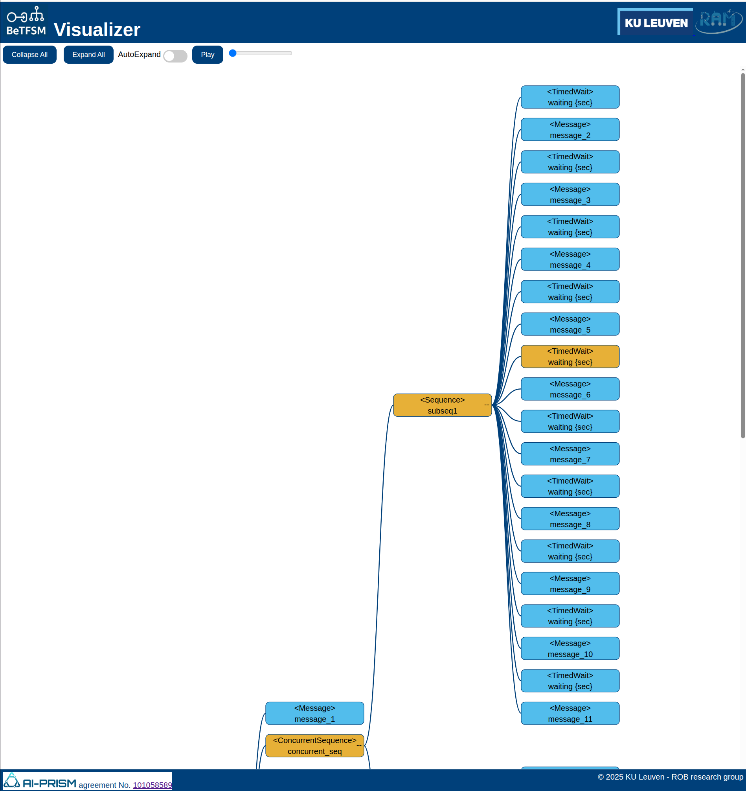

## Graphical user interface for BeTFSM

### Running the BeTFSM web-server user interface


A graphical user interface is provided to monitor a BeTFSM-tree.

Using the graphical user interface is very easy.  One needs just to replace
the BeTFSMRunner with BeTFSMRunnerGUI.  A webserver will be started that serves
the graphical user interface at `localhost:8000`.


``` py
sm = build_tree()
runner = BeTFSMRunnerGUI(sm,bb, frequency=100.0, publish_frequency=5.0, debug=False, display_active=False)
outcome=runner.run()
```


A full example can be found in ```betfsm_examples/guiexample_simple1.py```
```
import threading
import webbrowser

# ---- building the state machine -----
from betfsm.betfsm import (
        Sequence, ConcurrentSequence, TimedWait, TimedRepeat, Message, SUCCEED, Generator, Repeat
)
from betfsm.logger import get_logger
from betfsm.betfsmrunnergui import BeTFSMRunnerGUI

# ---------------------------------------
def build_tree():
    sm = Sequence("concurrent_sequence_outer", [
        Message(msg="This demo uses ConcurrentSequence, Sequence, TimedRepeat"),
        Message(msg="--- concurrent_sequence started ---"),
        ConcurrentSequence("concurrent_sequence", [
            Sequence("sequence1", [
                Message(msg="   --- sequence 1 started ---"),
                TimedRepeat("timedrepeat1", 5, 5, Message(msg="      sequence 1: 5 times every 5 second")),
                Message(msg="   --- sequence 1 ended   ---")]),
            Sequence("sequence2", [
                Message(msg="   --- sequence 2 started ---"),
                TimedRepeat("timedrepeat1", 10, 6, Message(msg="      sequence 2: 10 times every 6 second")),
                Message(msg="   --- sequence 2 ended   ---")]),
            Sequence("sequence3", [
                TimedWait("waiting 20 sec", 20.0),
                Message(msg="I like to interrupt!", logFunc=get_logger().warn)]),
        ]),
        Message(msg="--- concurrent_sequence ended   ---")
    ])
    return sm


# ---------------------------------------

def main():
    bb = {}
    sm = build_tree()
    runner = BeTFSMRunnerGUI(sm,bb, frequency=100.0, publish_frequency=5.0, debug=False, display_active=False)
    runner.run()

if __name__ == "__main__":
    main()

```

Other examples are provided in ```guiexample_simple2.py``` and ```guiexample_large.py```.

### Using the GUI

Go with a webbrowser to `localhost:8000` after you have started the BeTFSM server.  Once you loaded the page, you can start/stop the server and the page will automatically reload if the server becomes available again (checking every 5 seconds).

The GUI displays a tree representing the BeTFSM tree. The orange nodes are currently active.

In the GUI nodes can be expanded or collapsed by pressing the "-" or "+" ons the right side of each node.  You can also expand all nodes or collapse all nodes.

Very handy is the AutoExpand option, this will collapse the tree but expand all nodes that are needed to visualize all **active** nodes.

The Play button and sliding bar are currently not implemented. Their purpose will be to go back and forward in time using a history of the execution.



