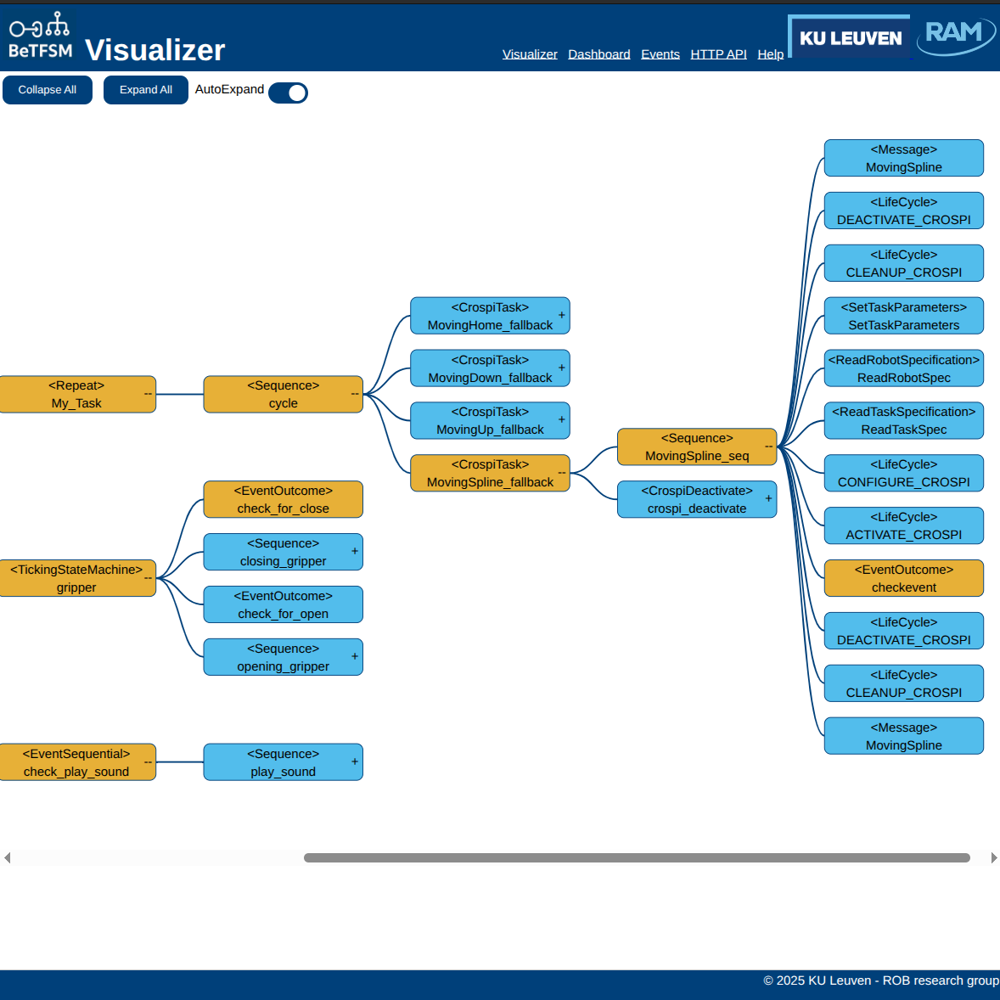

## Executing a BeTFSM Tree


This tutorial goes deeper in how we can **execute**, **configure** the execution of a BeTFSM tree, add additional **debug** information and
**visualize** the execution 

### Running the BeTFSM web-server user interface


Runner or ROSRunner provides a way to execute,  a graphical user interface to monitor a BeTFSM-tree, and a way to configure
your BeTFSM from the command prompt.

A webserver will be started that serves the graphical user interface at `localhost:8000` (it uses 0.0.0.0, so it
remains local and does not serve outside your computer by default).
The console output will provide a link.  When you need to run different BeTFSM executions:
 
  - Check whether you could run on the same execution using a Concurrent node.
  - Execute it separately and configure the BeTFSM to serve the visualizations
    on a different web-addres.

Visualization and debugging output happen at the **publish_frequency**, which is different from the **frequency** at which
the BeTFSM nodes are ticking.

When the BeTFSM execution stops, the front-end page will
remain active and will be polling at a slow frequency to ensure that it is possible
to stop the BeTFSM execution, and when you later restart, the page and the BeTFSM will find 
each other again.


You can also use the command-line arguments not to execute, but to **generate a .dot** file, in [GraphViz](https://graphviz.org/) format,
or to **generate a .json** file that can be used for further analysis of the BeTFSM-tree.  Currently the .json format does not contain
enough information to reconstruct the BeTFSM tree.

For example to visualize the tree using Graphviz, you could do:
``` bash
gui_example_simple1 --generate_dot gui_example_simple1.dot
xdot gui_example_simple1.dot
```


The basic instructions to run your BeTFSM tree are very easy:

``` py
sm = build_tree()
runner = Runner(sm,bb, frequency=100.0, publish_frequency=5.0, debug=False, display_active=False)
outcome=runner.run()
```

This is a [full description](runner.md) of how to call the Runner in **Python** and of the **command line arguments** to further configure
during execution time.


A full example can be found in ```betfsm/betfsm_examples/guiexample_simple1.py```

```python linenums="0"
--8<-- "betfsm/betfsm_examples/guiexample_simple1.py"
```


Other examples are provided in ```guiexample_simple2.py``` and ```guiexample_large.py```.

### Using the GUI

Go with a webbrowser to `localhost:8000` after you have started the BeTFSM server.  Once you loaded the page, you can start/stop the server and the page will automatically reload if the server becomes available again (checking every 5 seconds).

The GUI displays a tree representing the BeTFSM tree. The orange nodes are currently active.

In the GUI nodes can be expanded or collapsed by pressing the "-" or "+" ons the right side of each node.  You can also expand all nodes or collapse all nodes.

Very handy is the AutoExpand option, this will collapse the tree but expand all nodes that are needed to visualize all **active** nodes.

The Play button and sliding bar are currently not implemented. Their purpose will be to go back and forward in time using a history of the execution.




