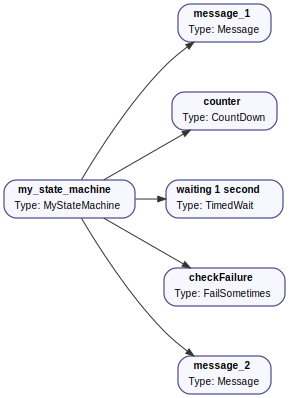
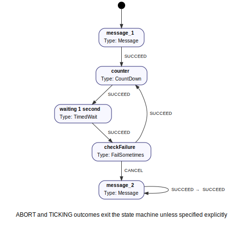

## Specifying state machines

BeTFSM is an hybrid framework that uses both primitives from behavior trees as wel as finite state machine specifications.
This tutorial explains how to specify a state machine.
You can find the code of the example in 
[betfsm_examples](https://github.com/Robotics-Research-Group-KUL/betfsm/blob/main/betfsm/betfsm_examples) in the file
[example_statemachine.py](https://github.com/Robotics-Research-Group-KUL/betfsm/blob/main/betfsm/betfsm_examples/example_statemachine.py).


### Defining some BeTFSM nodes to play with

We first define some nodes to do something non-trivial.  A CountDown node that at each tick
counts down until 0 is reached:
``` py

# A user defined TickingState:
class CountDown(Generator):
    """
    A simple generator state that counts down from a given number.
    """
    def __init__(self, name, count):
        super().__init__(name, [SUCCEED])
        self.count = count

    def co_execute(self, blackboard):
        for i in range(self.count, 0, -1):
            get_logger().info(f"{self.name}: {i}")
            yield TICKING
        get_logger().info(f"{self.name}: Finished counting down!")
        yield SUCCEED
```


And a node that randomly fails sometimes, such that we can demonstrate non-trivial transitions
in the state-machine:

``` py

# A user defined TickingState:
class FailSometimes(Generator):
    """
    Fails randomly with probability 1/n.
    """
    def __init__(self, name, n=3):
        super().__init__(name, [CANCEL,SUCCEED])
        self.n = n

    def co_execute(self, blackboard):
        get_logger().info(f"{self.name}: I will failing randomly 1 out of {self.n} times ")
        if random.randrange(self.n)==0:
            get_logger().info(f"{self.name}: CANCEL ")
            yield CANCEL
        else:
            get_logger().info(f"{self.name}: SUCCEED ")
            yield SUCCEED

```

### Defining the state machine

We typically define a statemachine by defining a class that inherits from [TickingStateMachine][betfsm.betfsm.TickingStateMachine].  
This makes the state machine easily reusable in other parts of your overall BeTFSM tree.

!!! warning
    BeTFSM is built to encourage users to develop an hierarchy of BeTFSM nodes.  Users could be tempted to define their whole application logic in one big state machine.  To increase reuseability, users are advised to split up into smaller BeTFSM nodes and achieve the rest of the functionality by implementing and composing a few smaller statemachines. 


The overall procedure is:

 - create your the substates of the statemachine. These can be single nodes 
   (as defined above) or can be behavior tree primitives such as Sequence or 
   Fallback, or can be another state machines.

 - add the states to the state machine using the ```add_state``` method. This method takes two parameters, the state and a table of transitions.

 - the table of transitions is specified using a Python dictionary that maps each outcome
   to a state object or a string representing either the name of a state object or 
   a string representing an outcome of the overall state machine.  These outcomes need
   to be specified in the constructor of TickingStateMachine.  In that case 
   the statemachine will exit with that given outcome.

``` py
class MyStateMachine(TickingStateMachine):
    def __init__(self,name):
        super().__init__(name,[SUCCEED])
        self.home = Message(msg="I am in the home state")
        self.counter = CountDown("counter", 3)
        self.waiting = TimedWait("waiting 1 second",1.0)
        self.failingstate = FailSometimes("checkFailure",3)
        self.final   = Message(msg="I am in the end state")

        self.add_state(self.home,transitions={SUCCEED:self.counter}) 
        self.add_state(self.counter,transitions={SUCCEED:self.waiting})
        self.add_state(self.waiting,transitions={SUCCEED:self.failingstate})
        self.add_state(self.failingstate,transitions={SUCCEED:self.counter,CANCEL:self.final})
        self.add_state(self.final,transitions={SUCCEED:SUCCEED})
        self.set_start_state(self.home)
```

Another approach to specify a state machine is to use a plain [TickingStateMachine][betfsm.betfsm.TickingStateMachine] object and add the states and transitions externally.  
This could be advisable when you want to build a generator that generates the state machine (or complete BeTFSM tree) from a domain specific file.

### Visualization:


We can visualize the BeTFSM tree we just defined by calling our program with specific
command-line parameters to generate these visualizations (instead of executing).
The generated files are [graphviz](https://graphviz.org/) files, and converted
to an svg file.  Editors such as Visual Code can display the .dot format natively.

```
./example_statemachine.py --generate-dot=example_statemachine.dot
dot -Tsvg example_statemachine.dot -o example_statemachine.svg 
```




You can also visualize the state-machine part of a BeTFSM tree (with root 'my_state_machine'):
```
./example_statemachine.py --generate-sm-dot=example_statemachine_sm.dot --select-name=my_state_machine
```



### Putting everything together


In the file ```betfsm_examples/example_statemachine.py```, you find everything put together, including
the boiler-plate to run the BeTFSM tree


```python linenums="1"
--8<-- "betfsm/betfsm_examples/example_statemachine.py"
```
