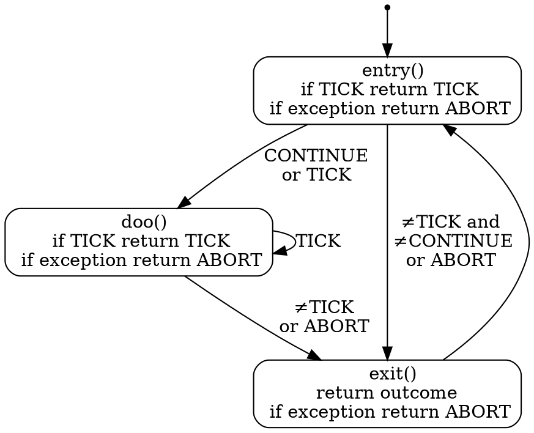
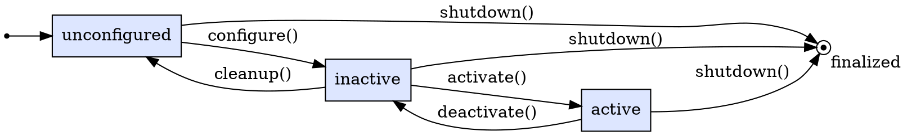
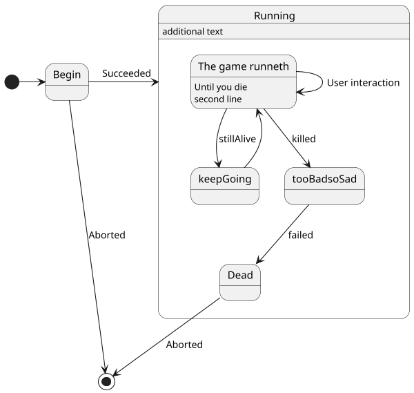
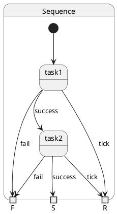
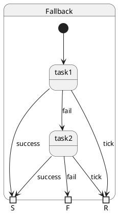
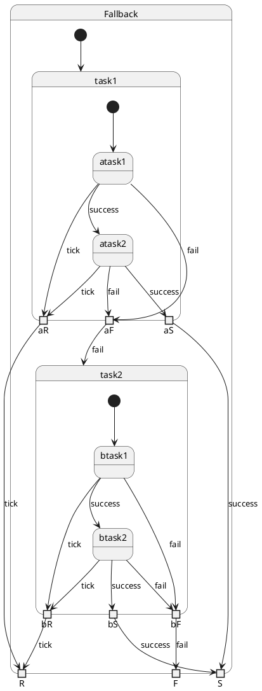

## documentation provided in mkdocs


....
## Used doc
[ros2-tutorial](https://ros2-tutorial.readthedocs.io/en/latest/python_node_explained.html)

[ros2 github examples](https://github.com/ros2/exampleshttps://github.com/ros2/examples)
[demos](https://github.com/ros2/demos/tree/ea3661152a87bc48e3f277ca8131c85a1a23d661)

[mkdocstrings](https://mkdocstrings.github.io/griffe/reference/docstrings/)

## TICKING outcome

- having a TICKING outcome.  Every "durative" state (i.e. that takes some time to complete) ensures that he returns within a short time (i.e. < tick time)
  a TICKING outcome that goes back to outcome of the most outer statemachine.
     - more similar to rFSM
     - would make it possible to define "parallel" states by implementing some special statemachines that distribute the execute calls.  (Everying is still
       single threaded).  We could have different implementations for different policies to finish (e.g. "join", "abort other machines if success and/or fail",....)
    - Ros service calls would be handled by specialized state type with and execute that refers to underlying methods:
        - entry: with outcome TICK or something related to functionality. the outcome CONTINUE would call directly the doo method in the same tick
            (to avoid unnecessary ticks)
        - doo method: with outcome TICK or something related to functionality
        - exit method: something related to functionality (cannot and should not return TICK, also be called in case of exceptions, i.e. python's finaly: )
      we'll need to distinguish between entry/doo/exit using an internal state.  Some care is necessary that this doesn't go wrong when exceptions are called.

  This would allow to have parallel state machines with a trajectory generator that is publishing the trajectory and another one with an eTaSL.
  Synchronization between paralal state machines can be using the blackboard "shared" memory (although locks are not necessary, it is still single threaded.)
  by having monitor nodes that continue when a certain blackboard slot has a given value.
  This would come closer to the original "blackboard" idea where the blackboard was active and could react to certain.

  Or parallel state machines corresponding to two robot arms that are sometimes cooperating and sometimes not.

  The event_state, service_state would be also TICKING,  using a call_async() and checking the returned future at each tick.

  The outer loop or action server will do the real looping (as long as it receives TICKING). Whenever execute() is called, a method in one of the states of the following statemachine is called, and the statemachine transitions according to the output of this method.  In each state, it is also
  metioned when execute() will return value. (it expects to be called back appropriately)


## Detailed semantics of the entry, doo, and exit functions: 



### entry(self, blackboard)
called the first time execute() is called.


#### Parameters

- blackboard: Blackboard

#### Returns

A string with value:
- CONTINUE (execute will call directly doo() )
- TICKING (execute will return and next time will call doo() )
- other string ( exit() will be called)

#### Note:

- if this throws an exception, outcome=ABORT  and and exit()- is called
  If one likes more detailed behavior, entry needs to catch the exception itself.

### doo(self, blackboard)

is repeatedly called the first time execute() is called.

#### Parameters

- blackboard: Blackboard        

#### Returns

A string with value:
- TICKING (execute will return and next time will call doo() )
- other string ( next time, execute will call  exit() )

#### Note:

- if this throws an exception, outcome=ABORT  and and exit()- is called
  If one likes more detailed behavior, entry needs to catch the exception itself.        

### exit(self, blackboard)

method that is always called when execute is called the last time

#### Parameters

- blackboard: Blackboard

#### Returns

A string the outcome (next time execute will call entry() )    

#### Note:
        
- if this throws an exception, outcome=ABORT  and and exit()- is called
  If one likes more detailed behavior, entry needs to catch the exception itself.


## State machine to propagate TICKING

- Statemachine needs memory the remember the underlying state that was ticking
- If outcome==TICKING, remember state, otherwise reset for next time to starting node


## Lifecycle





## Design questions


1. who should manage the name of the node, the instance or the state machine who owns the node.  In Yasmin it is the state machine, but this
   duplicates the name management for all different types of nodes.
2. TickingState, Generator,... require outcomes such as TICKING, ABORT,  should they be adding these outcomes themselves, or should
   the check in initialization whether these are added.  (such that users always can see what are the possible outcomes of a node in 
   the code)


## PlantUML



second:


Sequence:



Fallback



Hierarchical


## Install mkdocs

```
python3 -m venv --system-site-packages .venv
touch .venv/.COLCON_IGNORE
source .venv/bin/activate
pip install mkdocs mkdocstrings['python']
pip install mkdocs_puml
pip install mkdocs-mermaid2-plugin
```
