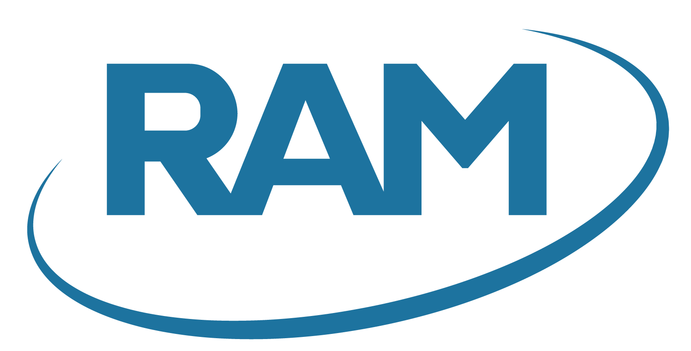
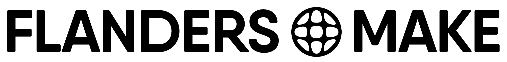

BeTFSM is a library for "ticking" statemachines and behavior trees. In this unified framework, discrete tasks can be specified with the modularity of
behavior trees and at the lower-level precise interaction can be specified using state machines. It targets discrete coordination of robotic systems at
both high- and low level.

It offers simple, python-based definition of BeTFSM-nodes, visualization of an executing tree, interaction with ROS2, and close interaction with [Crospi](https://github.com/Robotics-Research-Group-KUL/crospi).

## Documentation

Documentation, installation instructions and tutorials can be found at our
[website](https://robotics-research-group-kul.github.io/betfsm/)

## License and acknowledgements

Published under the [GNU LESSER GENERAL PUBLIC LICENSE](LICENSE) Version 3, 29 June 2007.

[About](https://robotics-research-group-kul.github.io/betfsm/about/)
<!--

This work was funded by the European Union’s Horizon 2020 research and innovation program 
under the grant agreement No. <a href="https://cordis.europa.eu/project/id/101058589">101058589</a> ( <a href="https://aiprism.eu/">AI-Prism</a>) 
-->

## Authors

(c) 2024-2026 [Erwin Aertbeliën](https://www.kuleuven.be/wieiswie/en/person/00002405) with contributions of [Santiago Iregui Rincon](https://www.kuleuven.be/wieiswie/en/person/00125886) and [Federico Ulloa Rios](https://www.kuleuven.be/wieiswie/en/person/00141400)

 KU Leuven, Department of Mechanical Engineering, ROB-Group. The ROB Group is part of core labs M&A and MPRO of Flanders Make.

